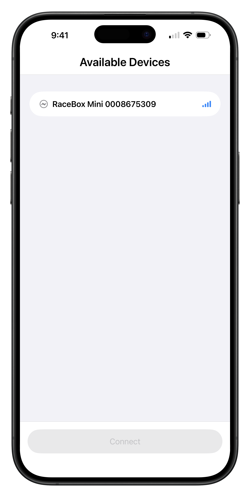
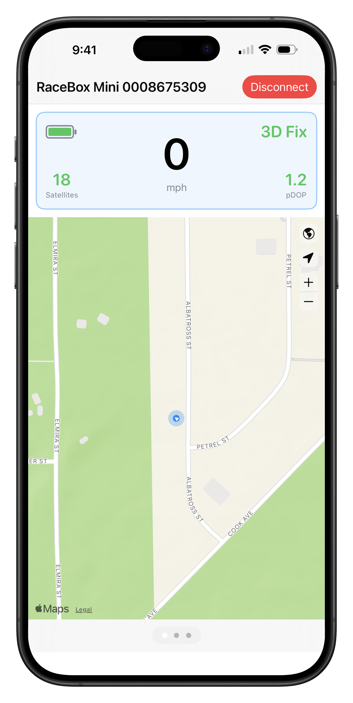
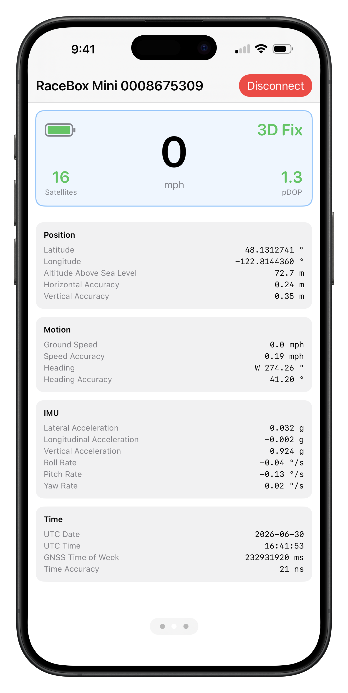
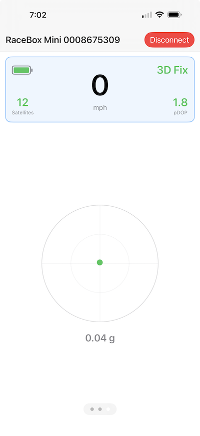
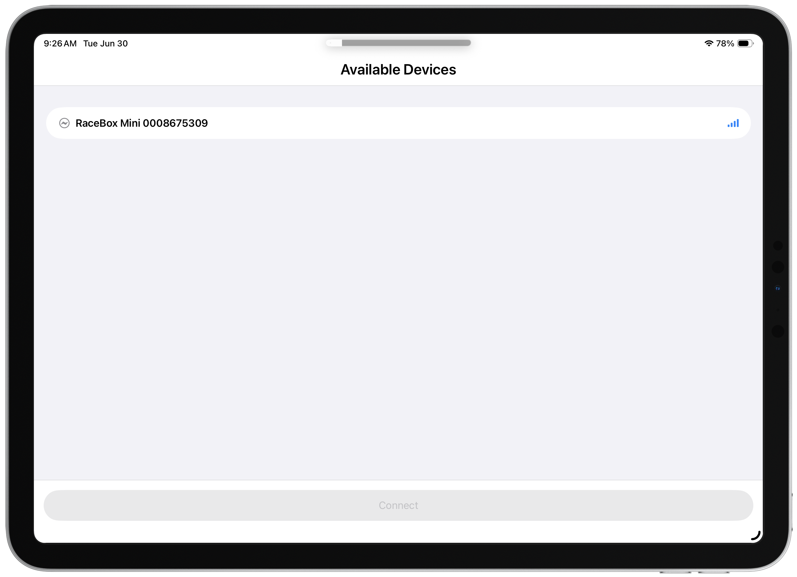
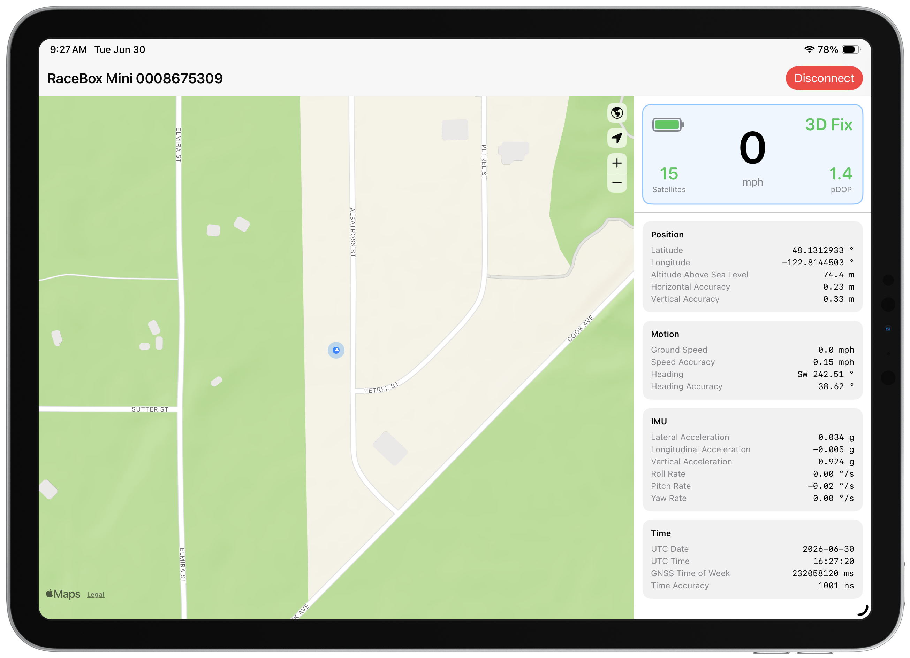

# Gnimu Monitor

A macOS/iOS app for monitoring real-time output from a Gnimu (RaceBox Mini) GNSS+IMU streaming telemetry monitor over BLE (Bluetooth Low Energy).

The macOS and iPad version features a single monitor window with live map showing current location on the left, and a data panel on the right that provides a view of real-time data streaming from the GNSS+IMU device.

The iPhone version of the app has three swipe-able panes - a live map panel, a streaming data panel, and a real-time g-force gauge panel. Each panel has a glancebox at the top the shows ground speed in the middle, with battery level, satellite lock count, GNSS fix status, and pDOP in the four corners.

The units for ground speed can be toggled between MPH and KPH by tapping or clicking the speed value display.

## Features

- BLE device discovery and connection
- Live data panels displaying position, motion, GNSS status, IMU, and timing
- Real-time map tracking with follow mode

## License

This project is licensed under the GNU General Public License v3.0. See [LICENSE](LICENSE) for details.

## Requirements

- Xcode 26.5+
- macOS 26.5+ or iOS 26.5+
- A Gnimu-compatible BLE device (advertises as "RaceBox")

## Building

Open `GnimuMonitor/GnimuMonitor.xcodeproj` in Xcode and build for your target device. BLE functionality requires a physical device — the simulator does not support Bluetooth.

## iPhone Screenshots

| Device Picker | Live Map | Data Panel | G-Force Meter |
| :---: | :---: | :---: | :---: |
|  |  |  |  |

## Mac/iPad Screenshots

| Device Picker | Live Map & Data Panel |
| :---: | :---: |
|  |  |
